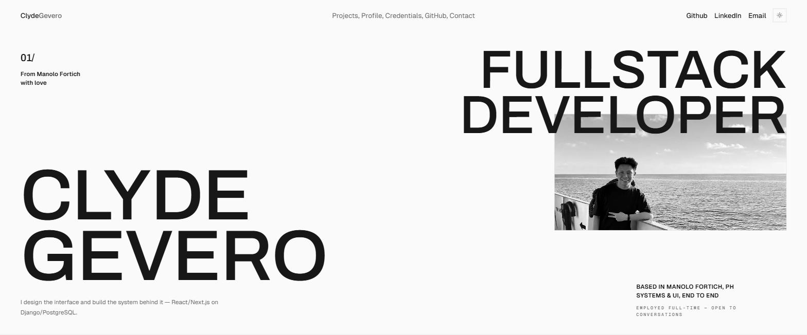

## About

<table>
<tr>
<td width="56%" valign="top">

<!-- Kept on one source line: inside a table cell GitHub turns newlines into breaks. -->
I build web and mobile products end to end — the interface people use, the API behind it, and the data model underneath. I care about the same things in both halves: clear structure, honest naming, and code the next person can follow.

- Ship features across the stack, from schema to screen
- Design interfaces that work before they decorate
- Cut manual steps with automation and targeted refactors
- Break monoliths into services that stay understandable

</td>
<td width="44%" valign="top">

</td>
</tr>
</table>

## Stack

Also in the kit

 

## Portfolio

<a href="https://clydegevero.is-a.dev/">clydegevero.is-a.dev</a> — selected work, credentials, and how to reach me

## Work I take on

| | |
|---|---|
| Internal tools that remove a manual step | Dashboards that answer a question fast |
| Business systems with one source of truth | APIs meant to be used by other teams |
| Automating the work nobody wants to repeat | Interfaces that hold up under real data |

